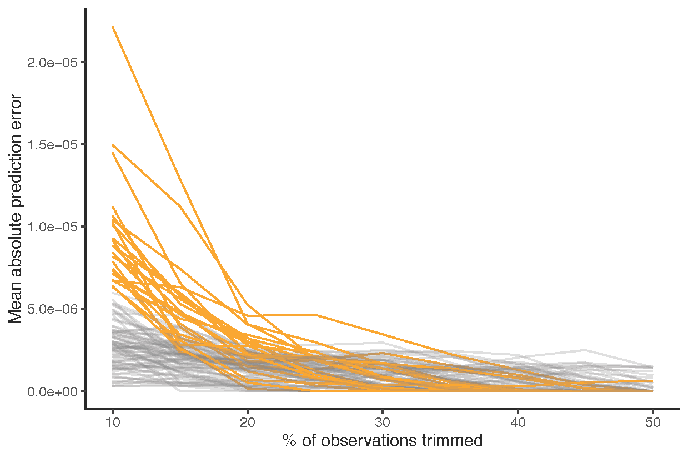

<!-- README.md is generated from README.Rmd. Please edit that file -->

# **trimsib**: Survey Estimates of Wartime Mortality

This package implements the methodology outlined in [Survey Estimates of
Wartime Mortality](https://gking.harvard.edu/sibs).

## Installation

You can install the most recent development version of `trimsib` as
follows.

``` r
if (!require(remotes)) install.packages("remotes")
remotes::install_github("mmukaigawara/trimsib", dependencies=TRUE)
```

## Workflows

Consider a dataframe `dat` with sibship-based mortality data. The
dataframe `dat` should contain the following variables:

- `Bj`: the number of siblings before the war reported by each
  respondent
- `Sj`: the number of survivors among `Bj` after the war
- `Dj`: the number of deaths (`Bj` - `Sj`)
- `Mj`: sibship-level mortality (`Dj` / `Bj`)
- `cluster`: cluster ID

Please make sure to name the number of siblings, survivors, and deaths
as `Bj`, `Sj`, and `Dj` in your dataset.

The first task is to construct weights (`Wj`), normalized weights
(`Zj`), and weighted mortality (`Zj`) as follows:

``` r
library(ggplot2)
library(dplyr)
library(trimsib)

dat$Wj <- dat$Bj / dat$Sj
dat$Zj <- dat$Wj / sum(dat$Wj)
dat$Vj <- dat$Zj * dat$Mj
```

Next, we examine how trimming affects prediction errors. To do so, we
can run the `suggest_trim` function and visualize the results using the
`plot_highlight` function.

The `suggest_trim` function requires:

- `data`: the dataset
- `vec_var`: the variable to trim (in this case, `Vj`)
- `cl_var`: the cluster ID variable (here, `cluster`)
- `formula`: the prediction formula (by default a quadratic function,
  `x + I(x^2)`)

``` r
result <- suggest_trim(data = dat, vec_var = "Vj", 
                       cl_var = "cluster", formula = "x + I(x^2)")
```

We then plot the results, highlighting clusters that may be
contaminated. The argument criteria sets the maximum mean absolute
prediction error at the cluster level. Clusters with a maximum error
greater than `criteria` are highlighted in orange.

``` r
plot_highlight(data_list = result, criteria = 6*10^-6)
```



The plot suggests that clusters highlighted in orange are likely
contaminated. It also suggests that, for these clusters to exhibit
trends similar to others, 20% of observations should be trimmed.

We proceed to trim 20% of observations (total, equally from both tails)
from each of these clusters using the `get_trimmed_data` function with
`trim_level = 0.2`:

``` r
dat_tr <- get_trimmed_data(result_iraq, criteria = 6*10^-6, 
                           trim_level = 0.2, vec_var = "Vj")
```

The output, `dat_tr`, contains data in which 20% of observations (total,
from both tails) have been trimmed for clusters suspected of
contamination.

Finally, we can compute the G-K mortality estimates using the `get_mort`
function.  
For example, to compute the mortality rate of cluster 1,  
we can use the following code.  
The parameter `max_Sj` specifies the maximum value of `S_j` to include
in the estimation  
(see [Survey Estimates of Wartime
Mortality](https://gking.harvard.edu/sibs) for details).

``` r
get_mort(dat_tr |> filter(cluster == 1), 
         max_Sj = 15)
```

The output is a tibble containing the estimated mortality rate along
with  
the upper and lower bounds of the 95% confidence interval.  
In the following example, the mortality rate is 3.03% with a 95% CI of
\[2.09, 3.98%\].

``` r
# A tibble: 1 × 4
  `Mortality rate` `Lower 95%CI` `Upper 95%CI`  Variance
             <dbl>         <dbl>         <dbl>     <dbl>
1           0.0303        0.0209        0.0398 0.0000232
```
